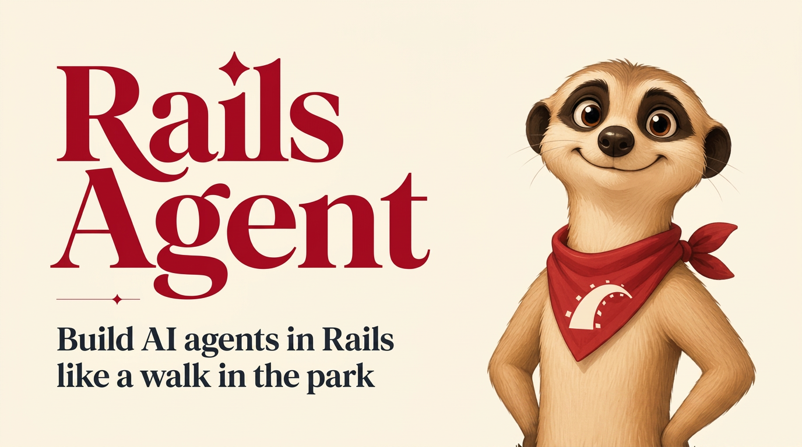

<p align="center">
  
</p>

<h1 align="center">Rails Agent</h1>

<p align="center">
  <strong>Build AI agents in Rails like a walk in the park.</strong>
</p>

<p align="center">
  The fullstack agentic platform for Rails. One gem install, chat in the dashboard,<br />
  and we handle the code, infra and deploys — you focus on the business logic.
</p>

<p align="center">
  <a href="https://rails-agent.com/docs/getting-started"><strong>Get started</strong></a>
  ·
  <a href="https://rails-agent.com/#how-it-works">How it works</a>
  ·
  <a href="https://rails-agent.com">Website</a>
  ·
  <a href="https://rails-agent.com/docs/concepts">Concepts</a>
  ·
  <a href="https://cloud.rails-agent.com">Cloud</a>
</p>

<p align="center">
  <code>Build</code> · <code>Test</code> · <code>Deploy</code> · <code>Monitor</code><br />
  <sub>Works with Rails 7+ · Ruby 3.2+ · Cloud runtime included</sub>
</p>

---

## Gem

`rails-agent-stack` — mountable engine at `/agents` (Sidekiq-style).

```ruby
# Gemfile
gem "rails-agent-stack", github: "Tiny-Bubble-Company/rails-agents"
```

---

## Our mission

**Make AI agent development a zero-knowledge task for Rails developers.**

You shouldn't have to become an AI engineer to add agentic features to your app. Rails Agent turns the Rails skills you already have into production-ready agents — one install, one chat, one deploy.

| Pillar | What it means |
|--------|----------------|
| **Zero AI knowledge** | You don't need to understand LLMs, embeddings, or prompt engineering. If you can write Rails, you can ship agents. |
| **Zero config** | No API keys, no vector database, no Redis, no Vercel setup. Install the gem and we run the entire stack. |
| **Meet Kip** | Kip is the inbuilt coding agent that knows Rails Agent. Chat with Kip — it builds `app/agents/` for you. No new framework syntax to learn. Edit the code anytime if you want. |
| **Build → test → deploy → monitor** | One platform covers the whole lifecycle: draft, test, ship, and watch — no separate tools to wire up. |
| **Scalable agentic infra** | Hosted runtime, autoscaling, retries, and tracing are included. We handle the hard parts so you don't have to. |
| **Unified monitoring & debugging** | Every trace, log, error, and cost is searchable in `/agents`. One place to understand every run. |

---

## Zero config — you write the agent, we run everything else

No OpenAI account. No Anthropic account. No vector database, no Redis to provision, no Vercel setup. Rails Agent Cloud is the only thing you sign up for — and the only bill you pay.

| We handle | |
|-----------|--|
| **Models** | GPT, Claude, Gemini — routed and paid for by us. No BYOK. |
| **Vector store** | Embed and retrieve knowledge. No pgvector, no Pinecone. |
| **Queue & workers** | Long-running tools, streaming, retries — all handled. |
| **Deploys & scaling** | Push once, we autoscale. Rollbacks in one click. |
| **Traces & logs** | Every run, every tool call, every token — searchable. |
| **Secrets & auth** | Store credentials once. Agents get them at runtime. |

---

## Your agent is a directory

No YAML soup. No hidden config. Every agent is one folder inside your existing Rails app — and you can read it top to bottom in a minute.

```
app/agents/support/
├── agent.rb            # The brain — RailsAgents::Base subclass
├── prompt.md           # How it talks (system prompt)
├── tools/              # Things the agent can do
├── skills/             # Composable multi-step behaviors
├── memory.rb           # What it remembers
├── knowledge/          # What it knows (RAG — we embed it)
├── channels/           # Slack, web chat, cron, …
└── evals/              # How you know it works
```

---

## How it works

Same path as the [docs](https://rails-agent.com/docs/getting-started). Don't sign up on the website first — start in your Rails app.

| Step | |
|------|--|
| **01 · Add the gem** | `gem "rails-agent-stack", github: "Tiny-Bubble-Company/rails-agents"` |
| **02 · Install** | `bundle install` then `bin/rails generate rails_agents:install` |
| **03 · Restart → /agents** | `bin/dev` → open `http://localhost:3000/agents` — like Sidekiq |
| **04 · Build with Kip** | Describe the agent in plain English. Kip writes `app/agents/<name>/`. Edit the Ruby anytime. |

### What to expect

1. The Agents UI loads at **`/agents`**.
2. Sign up with **GitHub** or **email** (4-digit code). Connecting usually writes `RAILS_AGENTS_API_KEY` + `RAILS_AGENTS_PROJECT_ID` to `.env`. If not, copy them from [Dashboard → API keys](https://cloud.rails-agent.com/dashboard/keys) — and set the same vars on production later.
3. After signup, **Kip** helps you build your first agent in chat.

Full walkthrough: [rails-agent.com/docs/getting-started](https://rails-agent.com/docs/getting-started)

---

## Channels

Ship the same agent to every channel — Slack, Discord, Web Chat, Google Chat, Microsoft Teams, WhatsApp, Twilio, Telegram, Linear, GitHub, Cron, and a REST API. One command from the CLI or one click in the dashboard. Everything lives in your agent's `channels/` folder.

Browse: [rails-agent.com/channels](https://rails-agent.com/channels)

---

## Production features

| Feature | |
|---------|--|
| **Durable execution** | Workflows survive crashes and restarts. Agents park when waiting, resume on the next message. |
| **Sandboxed compute** | Agents run code in isolated sandboxes. |
| **Multi-channel delivery** | One agent codebase → web chat, Slack, API, cron, CLI. |
| **Human-in-the-loop** | Tools that need confirmation trigger approval gates. |
| **Subagents** | Delegate specialized work to child agents. |
| **Evaluations** | Test suites with scoring rubrics on every deploy. |

---

## How we compare

Other Rails AI gems give you a client. **We give you the whole platform.**

RubyLLM and ActiveAgent are great libraries — but you still need AI knowledge, build the dashboard, and run the runtime yourself. Rails Agent ships the whole platform — no AI expertise required.

| Feature | Rails Agent | RubyLLM | ActiveAgent | DIY (LangChain + glue) |
|---------|:-----------:|:-------:|:-----------:|:----------------------:|
| Setup | One gem, one CLI command | Wire clients manually | Wire mailer-style classes | Python + YAML + glue |
| AI knowledge required | None — just Rails | You wire models & prompts | You wire models & prompts | Deep LLM & ops expertise |
| Dashboard included | ✓ | — | — | — |
| Build agents by chatting | ✓ | — | — | — |
| Hosted runtime | Included, one-command deploy | Bring your own | Bring your own | You build & run it |
| Traces, evals, monitoring | ✓ | — | — | Wire it yourself |
| Memory & knowledge (RAG) | Built-in, no vector DB | Wire pgvector yourself | Wire it yourself | Wire it yourself |
| Model neutral (OpenAI, Claude, Gemini) | ✓ | ✓ | ✓ | ✓ |
| Human-in-the-loop approvals | ✓ | — | — | DIY |
| Uses your Rails app as-is | ✓ | ✓ | ✓ | — |
| Time to first agent in prod | An afternoon | A week | A week | A month+ |

Full breakdowns: [vs RubyLLM](https://rails-agent.com/compare/rubyllm) · [vs ActiveAgent](https://rails-agent.com/compare/activeagent) · [vs LangChain](https://rails-agent.com/compare/langchain)

---

## Pricing

| | Developer | Studio | Enterprise |
|--|-----------|--------|------------|
| **Price** | Free | $49 /dev · month | Custom |
| | Cloud sandbox for building & testing | Production hosted runtime | Dedicated support & SLAs |
| | Full dashboard, traces and evals | Unlimited workspaces | SSO / SAML, RBAC, audit logs |
| | Not for production traffic | Traces, evals, human review | Region pinning, MSA |

Details: [rails-agent.com/pricing](https://rails-agent.com/pricing)

---

## Configuration

The gem always talks to **https://cloud.rails-agent.com** — no base URL env vars.

```ruby
# config/initializers/rails_agents.rb
RailsAgents.configure do |config|
  config.api_key = ENV["RAILS_AGENTS_API_KEY"]
  config.project_id = ENV["RAILS_AGENTS_PROJECT_ID"]
end
```

```bash
# .env (local) and your production host env
RAILS_AGENTS_API_KEY=rak_sandbox_…
RAILS_AGENTS_PROJECT_ID=prj_…
```

Connecting from `/agents` (or `rails-agents login`) writes these for you. If they are missing, copy them from [Dashboard → API keys](https://cloud.rails-agent.com/dashboard/keys). Also set the same vars on your production server before deploy.

---

## Engine

`/agents` is Sidekiq-simple: signup → API key on disk → iframe of the cloud dashboard.

When you vibecode (or hit **Test** / **Deploy**) inside that iframe, the cloud messages the parent page. `POST /agents/pull` fetches files and writes them into `app/agents/<slug>/` on your machine.

```bash
bundle exec rails-agents run support "Where is order 42?"
bundle exec rails-agents deploy support
bundle exec rails-agents pull support
bundle exec rails-agents logs support
```

---

## Development (this repo)

```bash
bundle install
bundle exec rspec
```

Local path testing (see `rails-agents-boilerplate` sibling app):

```ruby
gem "rails-agent-stack", path: "../rails-agents", require: "rails_agents"
```

---

## License

MIT — see [MIT-LICENSE](MIT-LICENSE).

---

Built for Rails developers, by people who'd rather write Ruby than YAML prompts. Kip approves.

[rails-agent.com](https://rails-agent.com)
